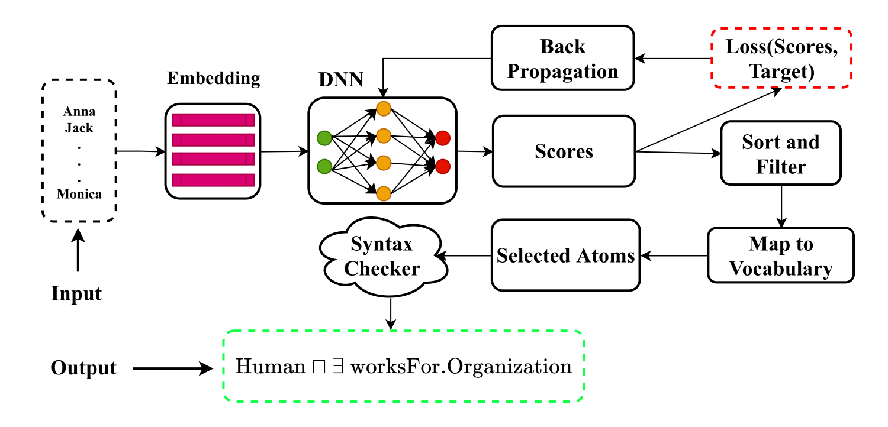

# NeuralClassExpressionSynthesis
Learning class expressions in DL using neural networks




## Installation

Clone this repository:
```
https://github.com/dicegroup/NeuralClassExpressionSynthesis.git
``` 

Make sure Anaconda3 is installed in your working environment then run the following to install all required librairies for NCES:
```
conda env create -f environment.yml
```
A conda environment (nces) will be created. Next activate the environment:
``` conda activate nces```

Download Datasets from [drive](https://drive.google.com/file/d/16tmjo1OZ5MqY_JwXUg5Fj1WxfWtOXACe/view?usp=sharing), extract it into NeuralClassExpressionSynthesis/Method and rename the folder as Datasets

To run search based algorithms CELOE, OCEL, ELTL and ECII, install Java 8+ and Maven 3.6.3+

Dowload DL-Learner-1.4.0 from [github](https://github.com/SmartDataAnalytics/DL-Learner/releases) and extract it into the directory Method

Clone DL-Foil from [bitbucket](https://bitbucket.org/grizzo001/dl-foil.git) into Method

## Reproducing the reported results

### NCES (Ours)


*Open a terminal and navigate into Method/reproduce_results/* ``` cd NeuralClassExpressionSynthesis/Method/reproduce_results/```
- Reproduce training NCES: ``` python reproduce_training_concept_synthesizer.py``` with the following options:

``` --kb KB               Knowledge base name, default carcinogenesis
  --lr LR               Learning rate
  --num_workers NUM_WORKERS
                        Number of workers to use to load training data
  --rnn_n_hidden RNN_N_HIDDEN
                        Hidden size of recurrent neural networks
  --num_examples NUM_EXAMPLES
                        Total number of examples for concept learning
  --decay_rate DECAY_RATE
                        Decay rate for the optimizer
  --grad_clip_value GRAD_CLIP_VALUE
                        Gradient clip value
  --optimizer OPTIMIZER
                        Name of the optimizer to use
  --model MODEL         Name of the concept learner architecture to use (LSTM or GRU, default GRU)
  --max_num_atom_repeat MAX_NUM_ATOM_REPEAT
                        Maximum number of atom repetition in a given class expression
  --rnn_n_layers RNN_N_LAYERS
                        Number of recurrent network layers
  --index_score_upper_bound INDEX_SCORE_UPPER_BOUND
                        Upper bound for scoring atoms/tokens
  --index_score_lower_bound_rate INDEX_SCORE_LOWER_BOUND_RATE
                        Lower bound rate
  --drop_prob DROP_PROB
                        Dropout rate in neural networks
  ```

- To reproduce evaluation results on concept learning, please open the jupyter notebook file ReproduceNCES.ipynb

*Remark: --kb is one of carcinogenesis, mutagenesis, family-benchmark, semantic_bible, vicodi*

### DL-Learner (Lehmann et al.)

*Open a terminal and navigate into Method/dllearner/* ``` cd NeuralClassExpressionSynthesis/Method/dllearner/```
- Reproduce CELOE, OCEL, and ELTL concept learning results: ``` python reproduce_dllearner_experiment.py --algo --kb --max_runtime --num_probs```

### DL-Foil (Fanizzi et al.)

*Open a terminal and navigate into Method/dl-foil/* ``` cd NeuralClassExpressionSynthesis/Method/dl-foil/```

- Run mvn package

- Copy `generate_dlfoil_config_all_kbs.py` into dl-foil and run `python generate_dlfoil_config_all_kbs.py` to prepare configuration files for all knowledge bases

- Reproduce concept learning results: ` mvn -e exec:java -Dexec.mainClass=it.uniba.di.lacam.ml.DLFoilTest -Dexec.args=DL-Foil2/kb_config.xml `

### ECII (Sarker et al.)

*Open a terminal and navigate into Method/ecii/* ``` cd NeuralClassExpressionSynthesis/Method/ecii/```

- Run `python generate_config_ecii.py --kb "knowledge base name(s)" ` to prepare configuration files

- To start concept learning, run `java -Xms2g -Xmx8g -Xss1g -jar ecii_v1.0.0.jar -b kb/`

- Run `python parse_ecii_output.py --kb "knowledge base name(s)" ` to parse the output and save the results such as f_measure and runtime

## Acknowledgement 
We based our implementation on the open source implementation of [ontolearn](https://docs--ontolearn-docs-dice-group.netlify.app/). We would like to thank the Ontolearn team for the readable codebase.

