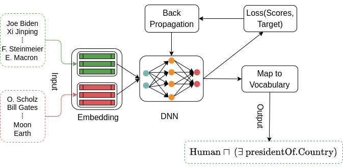
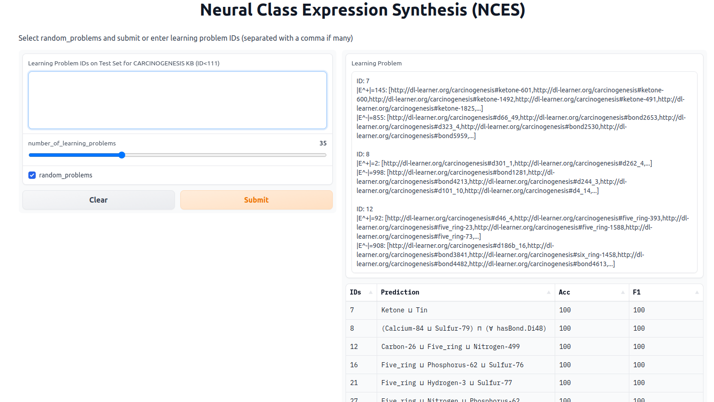

# NeuralClassExpressionSynthesis
Learning class expressions in DL using neural networks




## Installation

Clone this repository:
```
https://github.com/dicegroup/NeuralClassExpressionSynthesis.git
``` 

Make sure Anaconda3 is installed in your working environment then run the following to install all required librairies for NCES:
```
conda env create -f environment.yml
```
A conda environment (nces) will be created. Next activate the environment:
``` conda activate nces```

Download datasets from [hobbit](https://hobbitdata.informatik.uni-leipzig.de/NCES/). Extract the zip file into NeuralClassExpressionSynthesis/

To run search based algorithms CELOE, ELTL and ECII, install Java 8+ and Maven 3.6.3+

Dowload DL-Learner-1.4.0 from [github](https://github.com/SmartDataAnalytics/DL-Learner/releases) and extract it into NeuralClassExpressionSynthesis/

Clone DL-Foil from [bitbucket](https://bitbucket.org/grizzo001/dl-foil.git) into NeuralClassExpressionSynthesis

## Reproducing the reported results

### NCES (Ours)


*Open a terminal in NeuralClassExpressionSynthesis/*
- Reproduce training NCES: ``` python train.py ```. Use -h to see configuration options. For example --kbs helps specify the knowledge base name, which should be one of "carcinogenesis", "mutagenesis", "semantic_bible" or "vicodi".

- To reproduce evaluation results on concept learning: ``` python reproduce_nces.py ```. Use -h for more options.


### DL-Learner (Lehmann et al.)

*Open a terminal and navigate into dllearner/* ``` cd NeuralClassExpressionSynthesis/dllearner```
- Reproduce CELOE and ELTL concept learning results: ``` python reproduce_dllearner_experiment.py --algo --kb --max_runtime ```

### DL-Foil (Fanizzi et al.)

*Open a terminal and navigate into dl-foil/* ``` cd NeuralClassExpressionSynthesis/dl-foil```

- Run mvn package

- Run ` python generate_dlfoil_config_all_kbs.py ` to prepare configuration files for all knowledge bases

- Reproduce concept learning results: ` mvn -e exec:java -Dexec.mainClass=it.uniba.di.lacam.ml.DLFoilTest -Dexec.args=DL-Foil2/kb_config.xml `

### ECII (Sarker et al.)

*Open a terminal and navigate into ecii/* ``` cd NeuralClassExpressionSynthesis/ecii/```

- Run `python generate_config_ecii.py ` to prepare configuration files

- To start concept learning, run `java -Xms2g -Xmx8g -Xss1g -jar ecii_v1.0.0.jar -b kb/`

- Run `python parse_ecii_output.py ` to parse the output and save the results such as f_measure and runtime


### EvoLearner (Heindorf et al.)

*Open a terminal and navigate into evolearner/* ``` cd NeuralClassExpressionSynthesis/evolearner/```

- Run `python run_evolearner.py `. Use options to select the knowledge base, save results, or enable logging. Example `python run_evolearner.py --kbs carcinogenesis --save_results True --verbose True` 


## Bring your own data

To train NCES on a new knowledge base, create a new folder under datasets and add the OWL format of the knowledge base in the folder. Make sure the owl file has the same name as the folder you created. Follow the 3 steps below to train NCES on your knowledge base.

- (1) Generating training data for NCES: `cd generators/` then ` python generate_data.py --kbs your_folder_name `. Use -h for more options. For example, use `--num_rand_samples 500` combined with `--refinement_expressivity 0.6` to increase the amount of training data.

- (2) Computing an embedding for your knowledge base: `cd embeddings/` then ` python compute_embeddings.py --kbs your_folder_name --model_name ConEx `

- (3) Training NCES on your data: `cd NeuralClassExpressionSynthesis/ ` then ` python train.py --kbs your_folder_name `. Use -h to see more options for training, e.g., `--batch_size` or `--epochs`


## Start an interactive session with NCES (deployment)

Run ` python deploy_nces.py ` in a terminal. Use -h for more options. A public link will be created and valid for 72 hours. Open the link in a navigator. Start running NCES as in the screenshot below. We plan to host a permanent deployment of NCES on [huggingface](https://huggingface.co/) soon.

